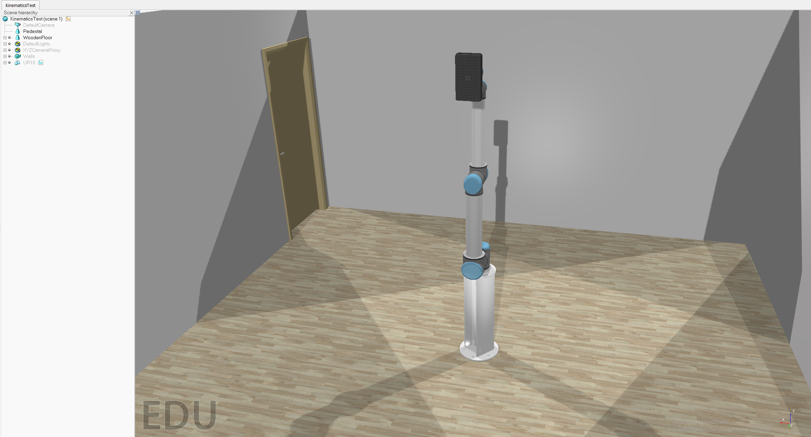

# *CoppeliaSim* Simulation

## Scene Setup

The scene is composed of an UR10 robot model available in *CoppeliaSim* model browser, with a Unigripper Co/Light Regular model attached to its flange. Additionally, the robot is setup on top of a cylindrical pedestal with 0.3 m diameter and 0.7 m height.




## Embedded Scripts

In this scene there is only a threaded child script that is associated to the robot model. This script simply starts the MATLAB API remote connection, retrieves the handles of the robot and its joints, and has a while loop that is executed every five seconds where the robot's tip position is printed in the command window - this is useful to compare with our forward kinematics solution.


```lua
function sysCall_threadmain()

    --[[ Initialization ]]--

    --Start MATLAB api
    simRemoteApi.start(19999)

    --Handle retreival
    local jointHandles={-1,-1,-1,-1,-1,-1}
    for i=1,6,1 do
        jointHandles[i]=sim.getObjectHandle('UR10_joint'..i)
    end
    local UR10=sim.getObjectHandle('UR10')
    local tip=sim.getObjectHandle('UR10_tip')
    
    -- Auxiliary variables for outputting current end-effector position
    sim.setIntegerSignal('showPos',0)
    local IKsol=0;
    
    --[[ Main loop ]]--
    while sim.getSimulationState()~=sim.simulation_advancing_abouttostop do
        if(sim.getIntegerSignal('showPos')==1) then
            sim.setIntegerSignal('showPos',0)
            -- get tip position relative to the robots' base
            local tip_pos=sim.getObjectPosition(tip,UR10)
            -- print tip position
            IKsol=IKsol+1
            print('_-_-_-_-_-_-_-_-_-_-_-_-_-_-_-_-_-_-_-_-_-_-_-_-_-_-_-_-_-_-_-_-_-_-_-')
            print('End-effector position '.. IKsol)
            print(tip_pos)
            -- reset value of IKsol, when reaching final solution
            if(IKsol==8) then
                IKsol=0
            end
        end
    end
    
end
```