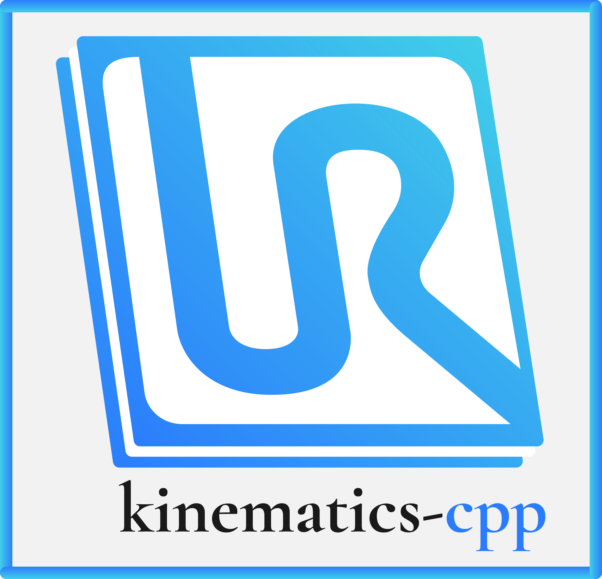

<h1 align="center">universal-robots-kinematics</h1>

<p align="center">
  <strong>A C++20 library for forward and inverse kinematics of Universal Robots (UR3/UR5/UR10) manipulators.</strong>
</p>

<p align="center">
  <a href="https://github.com/Jgocunha/universal-robots-kinematics/actions/workflows/ci.yml"></a>
  <a href="https://github.com/Jgocunha/universal-robots-kinematics/actions/workflows/static-analysis.yml"></a>
  <a href="https://codecov.io/gh/Jgocunha/universal-robots-kinematics"></a>
  <a href="https://github.com/Jgocunha/universal-robots-kinematics/releases/latest"></a>
  <a href="https://jgocunha.github.io/universal-robots-kinematics/"></a>
  <a href="https://github.com/Jgocunha/universal-robots-kinematics/wiki"></a>
</p>

<p align="center">
  <a href="https://en.cppreference.com/w/cpp/20"></a>
  <a href="https://cmake.org"></a>
  
  
  
</p>

---

This work was developed in the context of our MSc dissertations: *A Collaborative Work Cell to Improve Ergonomics and Productivity* by João Cunha, and *Human-Like Motion Generation through Waypoints for Collaborative Robots in Industry 4.0* by João Pereira, in which we got to work with the collaborative robotic arm **UR10 e-series**. 

Before producing our kinematics solution, we conducted a comprehensive literature review on the UR robots’ kinematics (see [`docs/REFERENCES.md`](https://github.com/Jgocunha/universal-robots-kinematics/blob/main/docs/REFERENCES.md)) and realised there was a lack of thorough and detailed analysis of their kinematics. Additionally, we found the [Universal Robots’ documentation](https://www.universal-robots.com/articles/ur/parameters-for-calculations-of-kinematics-and-dynamics/) confusing and unclear (at that time). 

Thus, the main goal of this work is to provide an **explicit and transparent guide into the UR robots kinematics** (using by reference the UR10 e-series) by expanding on the literature we found and describing every part of our analysis. 

We present a **forward kinematic solution based on the Modified Denavit-Hartenberg convention** and an **inverse kinematic solution based on a geometric analysis**.

This repository is the **C++ library** (UR3/UR5/UR10, C++20, CMake). The original MATLAB reference implementation and the CoppeliaSim scenes/models — both with CoppeliaSim integration — now live in a linked archive repository: [**Jgocunha/universal-robots-kinematics-matlab**](https://github.com/Jgocunha/universal-robots-kinematics-matlab).

***

## C++ source code

The C++ solution uses **C++20** and builds on **Windows, Linux, and macOS** via CMake.

### The `UR` class

Instantiate a robot and call `forwardKinematics` or `inverseKinematics`:

```cpp
#include <ur_kinematics/ur_kinematics.h>

universalRobots::UR robot(universalRobots::URtype::UR5);

// Forward kinematics
const universalRobots::UR::JointVector joints = { 0.4f, -1.0f, 1.2f, 0.3f, 0.8f, 0.2f }; // radians
universalRobots::pose tip = robot.forwardKinematics(joints);

// Inverse kinematics (up to 8 solutions)
const universalRobots::UR::IkSolutions ikSols = robot.inverseKinematics(tip);

// ikSols.valid[i] tells you whether ikSols.solutions[i] is a real solution
const bool hasSolution = ikSols.anyValid();
```

Supported robot types: `URtype::UR3`, `URtype::UR5`, `URtype::UR10`.

***

## Dependencies

### Eigen (automatic)

[Eigen 3.4.0](https://eigen.tuxfamily.org/) is fetched automatically by CMake at configure time — no manual installation required.

### GoogleTest (automatic)

[GoogleTest v1.15.2](https://github.com/google/googletest) is fetched automatically by CMake at configure time to build the test suite — no manual installation required.

> **CoppeliaSim integration** was removed from this repository. It now lives in the archive repo, [Jgocunha/universal-robots-kinematics-matlab](https://github.com/Jgocunha/universal-robots-kinematics-matlab).

***

## Building

**Requirements:** CMake 3.21+ (for presets; the build itself needs 3.20+), a C++20 compiler (GCC 10+, Clang 12+, MSVC 19.29+), Git (Eigen and GoogleTest are fetched from GitHub at configure time).

The build uses CMake presets (`debug`, `release`) with the default generator on each platform.

```bash
# Clone
git clone https://github.com/Jgocunha/universal-robots-kinematics.git
cd universal-robots-kinematics

# Configure and build (Eigen and GoogleTest are downloaded automatically)
cmake --preset release
cmake --build --preset release

# Run the demo
./build/release/ur_demo          # Linux/macOS
build\release\Release\ur_demo.exe # Windows
```

Swap `release` for `debug` to build the debug configuration under `build/debug`.

### Tests

```bash
ctest --test-dir build/release --output-on-failure   # add -C Release on Windows/multi-config
```

Coverage (GCC/Clang only, via `UR_KINEMATICS_COVERAGE`):

```bash
cmake -B build/coverage -DCMAKE_BUILD_TYPE=Debug -DUR_KINEMATICS_COVERAGE=ON
cmake --build build/coverage
ctest --test-dir build/coverage --output-on-failure
gcovr --root . --filter 'include/.*' --filter 'src/.*' --object-directory build/coverage
```

***

## Benchmarking

Benchmarking consists of:
 1. getting [compute times](https://stackoverflow.com/questions/22387586/measuring-execution-time-of-a-function-in-c) of forward and inverse kinematics functions;
 2. getting the error of the solutions.

The solutions were tested for a set of 100000 randomly generated target tip poses (the scripts were run in a Ryzen 5 3600 CPU at 4.28GHz).

MATLAB's compute times are 10x slower than with C++, so **the C++ solution is obviously recommended for use**.

 ### Average Computation Times (in seconds)

||MATLAB|C++|
|---|---|---|
|Forward Kinematics|1.832571E-05|1.39434e-06|
|Inverse Kinematics|1.612797E-04|1.07403E-05|

### Average error

To compute the average error the following flowchart was followed:


||*x*|*y*|*z*|*alpha*|*beta*|*gamma*|
|-|--|---|---|-------|------|-------|
average error|7.45E-14|1.86E-14|7.45E-14|4.14E-06|4.14E-06|4.14E-06|

**Units in**: *x, y, z* metres, *alpha, beta, gamma* radians.
