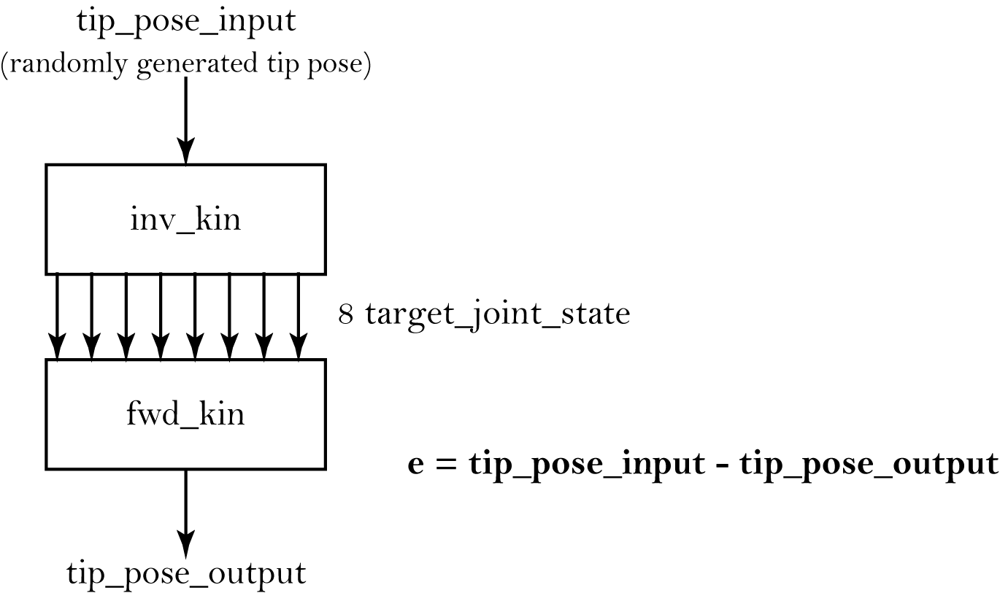

# universal-robots-kinematics

This work was developed in the context of our MSc dissertations: *A Collaborative Work Cell to Improve Ergonomics and Productivity* by João Cunha, and *Human-Like Motion Generation through Waypoints for Collaborative Robots in Industry 4.0* by João Pereira, in which we got to work with the collaborative robotic arm **UR10 e-series**. 

Before producing our kinematics solution, we conducted a comprehensive literature review on the UR robots’ kinematics (see [`docs/REFERENCES.md`](docs/REFERENCES.md)) and realised there was a lack of thorough and detailed analysis of their kinematics. Additionally, we found the [Universal Robots’ documentation](https://www.universal-robots.com/articles/ur/parameters-for-calculations-of-kinematics-and-dynamics/) confusing and unclear (at that time). 

Thus, the main goal of this work is to provide an **explicit and transparent guide into the UR robots kinematics** (using by reference the UR10 e-series) by expanding on the literature we found and describing every part of our analysis. 

We present a **forward kinematic solution based on the Modified Denavit-Hartenberg convention** and an **inverse kinematic solution based on a geometric analysis**.

This repository is the **C++ library** (UR3/UR5/UR10, C++20, CMake). The original MATLAB reference implementation and the CoppeliaSim scenes/models — both with CoppeliaSim integration — now live in a linked archive repository: [**Jgocunha/universal-robots-kinematics-matlab**](https://github.com/Jgocunha/universal-robots-kinematics-matlab).

***

## C++ source code

The C++ solution uses **C++20** and builds on **Windows, Linux, and macOS** via CMake.

### The `UR class`

Instantiate a robot and call `forwardKinematics` or `inverseKinematics`:

```cpp
#include "universalRobotsKinematics.h"

universalRobots::UR robot(universalRobots::URtype::UR5);

// Forward kinematics
const float joints[6] = { 0.4f, -1.0f, 1.2f, 0.3f, 0.8f, 0.2f }; // radians
universalRobots::pose tip = robot.forwardKinematics(joints);

// Inverse kinematics (up to 8 solutions)
float ikSols[robot.m_numIkSol][robot.m_numDoF] = {};
robot.inverseKinematics(tip, &ikSols);
```

Supported robot types: `URtype::UR3`, `URtype::UR5`, `URtype::UR10`.

***

## Dependencies

### Eigen (automatic)

[Eigen 3.4.0](https://eigen.tuxfamily.org/) is fetched automatically by CMake at configure time — no manual installation required.

### CoppeliaSim (optional)

Only needed for the CoppeliaSim integration. The CoppeliaSim remote API files are already bundled under `cpp/universalRobotsKinematics/Dependencies/CoppeliaSim/`. Enable it at configure time with `-DWITH_COPPELIASIM=ON`.

***

## Building

**Requirements:** CMake 3.20+, a C++20 compiler (GCC 10+, Clang 12+, MSVC 19.29+), Git (for Eigen fetch).

```bash
# Clone
git clone https://github.com/Jgocunha/universal-robots-kinematics.git
cd universal-robots-kinematics

# Configure and build (Eigen is downloaded automatically)
cmake -B build -S .
cmake --build build

# Run
./build/cpp/universalRobotsKinematics/Application/ur_app   # Linux/macOS
build\cpp\universalRobotsKinematics\Application\Debug\ur_app.exe  # Windows
```

### With CoppeliaSim

```bash
cmake -B build -S . -DWITH_COPPELIASIM=ON
cmake --build build
```

### Build options

| Option | Default | Description |
|---|---|---|
| `WITH_COPPELIASIM` | `OFF` | Include CoppeliaSim remote API integration |

***

## Benchmarking

Benchmarking consists of:
 1. getting [compute times](https://stackoverflow.com/questions/22387586/measuring-execution-time-of-a-function-in-c) of forward and inverse kinematics functions;
 2. getting the error of the solutions.

The solutions were tested for a set of 100000 randomly generated target tip poses (the scripts were run in a Ryzen 5 3600 CPU at 4.28GHz).

MATLAB's compute times are 10x slower than with C++, so **the C++ solution is obviously recommended for use**.

 ### Average Computation Times (in seconds)

||MATLAB|C++|
|---|---|---|
|Forward Kinematics|1.832571E-05|1.39434e-06|
|Inverse Kinematics|1.612797E-04|1.07403E-05|

### Average error

To compute the average error the following flowchart was followed:



||*x*|*y*|*z*|*alpha*|*beta*|*gamma*|
|-|--|---|---|-------|------|-------|
average error|7.45E-14|1.86E-14|7.45E-14|4.14E-06|4.14E-06|4.14E-06|

**Units in**: *x, y, z* metres, *alpha, beta, gamma* radians.
